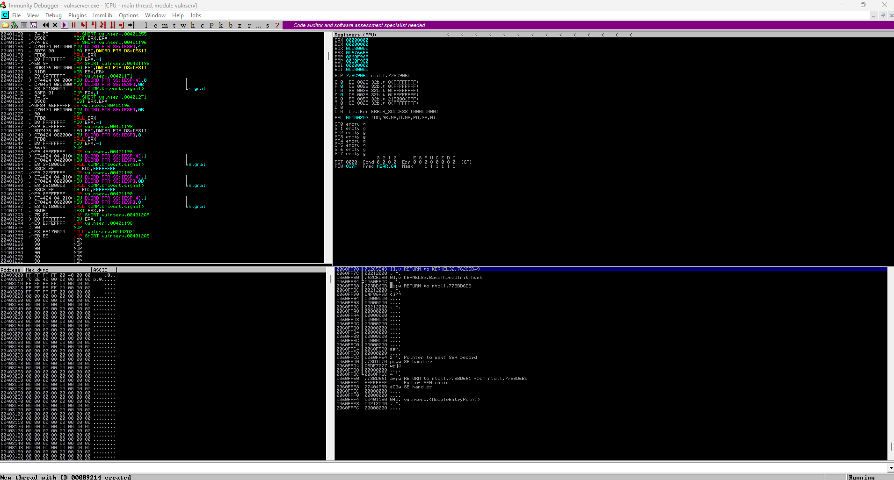
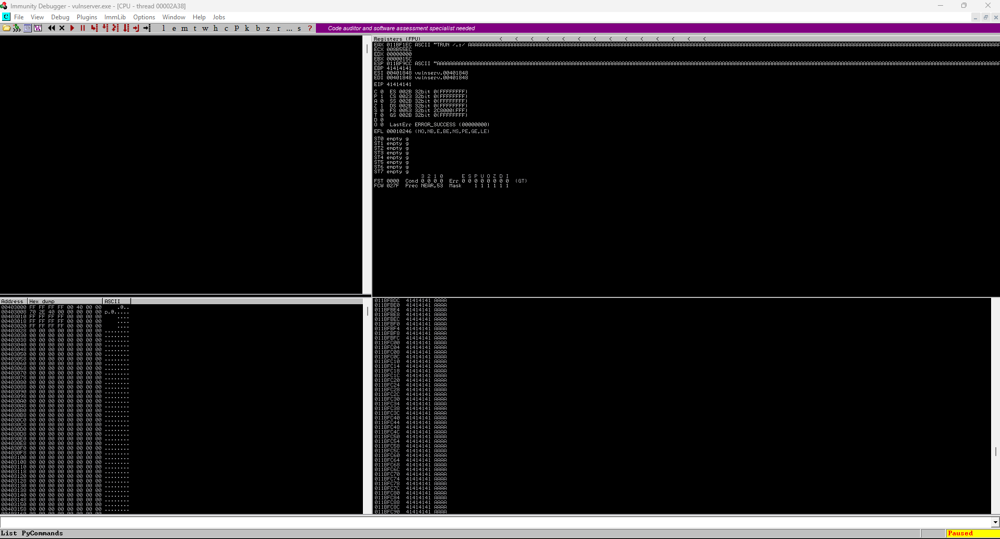

# Lab 2.3 — Vulnerability Types and Exploits

## 🎯 Objective
**“Explain various types of vulnerabilities.”**

This section focuses on identifying and understanding common weaknesses in applications, operating systems, hardware, and virtualization environments.  
Each question and hands-on lab demonstrates how these vulnerabilities manifest, their root causes, and methods to mitigate them.

---

## 📖 Background

A **vulnerability** is any flaw, misconfiguration, or condition that an attacker can exploit to compromise a system’s confidentiality, integrity, or availability.  
Recognizing these weaknesses allows security professionals to implement better prevention, detection, and remediation measures.

### Core Categories

| Category | Examples |
|:--|:--|
| **Application Vulnerabilities** | Memory injection, buffer overflow, race conditions (TOC/TOU), malicious or compromised updates |
| **Operating System Vulnerabilities** | Unpatched systems, privilege escalation flaws, kernel bugs, insecure defaults |
| **Web Vulnerabilities** | SQL injection (SQLi), Cross-Site Scripting (XSS), improper input validation |
| **Hardware Vulnerabilities** | Firmware exploits, end-of-life (EOL) or legacy hardware lacking updates |
| **Virtualization Vulnerabilities** | VM escape, resource reuse between guests |
| **Cloud-Specific Vulnerabilities** | Misconfigured IAM roles, tenant isolation failures, API exposure |
| **Supply-Chain Vulnerabilities** | Risks from service, hardware, or software providers introducing malicious or vulnerable components |
| **Cryptographic Vulnerabilities** | Weak algorithms, poor key management, low entropy RNG, reused IVs |
| **Misconfigurations** | Exposed ports, insecure permissions, disabled security controls |
| **Mobile Vulnerabilities** | Side loading, jailbreaking/rooting, insecure app permissions |
| **Zero-Day Vulnerabilities** | Exploited flaws with no available patch or mitigation |

---

## 🧩 MCQ Sets

The `scenarios/` folder contains several JSON sets covering this objective:

Each scenario includes:
- Four multiple-choice answers  
- Correct answer index  
- Examples and concise explanations  

---

## 🧑‍💻 Lab Concepts

Hands-on exercises reinforce how vulnerabilities appear and are mitigated:

1. **Memory Injection / Buffer Overflow**  
   Simulate unsafe input handling and analyze memory corruption in a controlled script.

    - Memory Struture (Top to Bottom)
        - Kernal > Stack > Heap > Data > Text
    - Stack Structure (Top to Bottom)
        - ESP (Extended Stack Pointer) > Buffer Space > EBP (Extended Base Pointer) > EIP (Extended Instruction Pointer) / Return Address
        - Overflow attack overflows Buffer Space and reaches over EBP layer to the EIP (Return Address)
        - Malicious code is executed in the EIP layer to control the stack and pointer
    - Steps to Execute Buffer Overflow
        - Spiking (Locate Vulnerabiilties)
        - Fuzzing (Send Characters to Break a Program)
        - Finding the Offset (Evaluate Breaking Point)
        - Overwriting the EIP 
        - Finding Bad Characters
        - Finding the Right Module
        - Generating Shellcode (Malicious Code)
        - Gain Root Access
    - Tools Used
        - Vulnserver
        - Immunity Debugger
    - Step 1: Connect to Vulnserver with Immunity Debugger
    
    - Step 2: Execute `buffer_overflow.py` to flood the buffer space into EBP and EIP and observe Immunity Debugger
    
    - Step 3: Perform Fuzzing to see how many bytes needed for crash
        ```bash
        ... 
        >>> Fuzzing Attempt Recieved:  b'Welcome to Vulnerable Server! Enter HELP for help.\n'
        >>> 2000
        >>> Fuzzing Attempt Recieved:  b'Welcome to Vulnerable Server! Enter HELP for help.\n'
        >>> 2100
        >>> Crashed at 2100 bytes
        ```
    - Step 4: Find Offset for where we overwrite EIP

2. **Race Condition (TOC/TOU) Example**  
   Demonstrate concurrent access flaws using multithreaded file writes.

3. **SQLi & XSS Scenarios**  
   Show how unvalidated input impacts web apps (using safe, local examples).

4. **Cryptographic Vulnerability Test**  
   Compare strong vs. weak algorithms (e.g., AES-256 vs. DES) and visualize brute-force times.

5. **Misconfiguration Audit**  
   Run a simple Python script that scans for open ports or default credentials on localhost.

---

## ▶️ How to Run

```bash
# Run any quiz set
cd lab-2-3-vuln-types/python
py lab.py

# Example output
Q1: A program writes more data into a buffer than it can hold...
Choices: ['Memory injection', 'Buffer overflow', 'Race condition', 'Malicious update']
Your answer: Buffer overflow
✅ Correct – Writing beyond buffer boundaries can corrupt memory and allow code execution.

# Buffer Overflow 

# Race Condition
